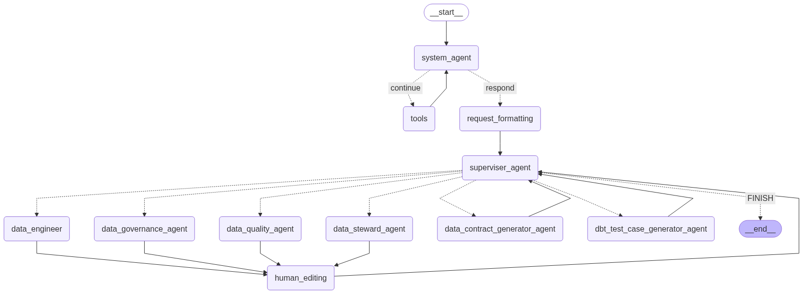

# 🧪 Alchemy — Multi-Agent System for Generating Data Contracts

**Alchemy** is a multi-agent orchestration system designed to generate validated **data contracts** from data schemas. It leverages LangGraph, LangChain agents, dbt expectations, and YAML-based schema definitions to automate the production of data product contracts within a **data mesh architecture**.

<p align="center">
  
</p>

---

## 🚀 Features

- Multi-agent LLM orchestration using LangGraph
- YAML schema parsing and contract generation
- Markdown documentation generation for data contracts
- Integration with dbt test case generation
- Human-in-the-loop review mechanism
- LangSmith integration for observability and debugging

---
## 📁 Project Structure

```bash
alchemy/
├── app/
│   ├── api/                   # Fast api's for web ui
│   ├── frontend/              # Frontend assetes and files
├── llm/
│   ├── agents/                # All LLM agents (data engineer, steward, governance, etc.)
│   ├── config/                # API keys and model config
│   ├── graph/                 # LangGraph builder and routing logic
│   ├── logs/                  # Optional logging
│   ├── models/                # Pydantic models including DataContract
│   ├── prompts/               # Prompt Jinja templates (e.g. data_contract.j2)
│   ├── tools/                 # Tool registry and callable tool logic
│   └── utils/                 # File IO, watermarking, user input handler
├── contracts/
│   └── ecommerce/             # Output folder per domain
│       ├── data_contract.yaml      # Final YAML contract
│       ├── data_contract.md        # Rendered markdown summary
│       └── dbt_test_cases.sql      # Auto-generated dbt test cases
├── formatted_orders.yml       # Sample schema input
├── requirements.txt
└── README.md
```

---
## 🧠 Architecture

The system uses the following LangGraph-based agent workflow:

1. **System Agent**: Initializes the flow, processes input, routes tools if needed.
2. **Tool Node**: Executes utility tools if the system detects a tool call.
3. **Request Formatter**: Prepares user inputs into structured format.
4. **Supervisor Agent**: Routes tasks to specialized agents.
5. **Specialized Agents**:
    - `DataEngineer`: Performs schema interpretation.
    - `DataStewardAgent`: Enforces naming conventions and standards.
    - `DataQualityAgent`: Adds dbt-expectations-based validations.
    - `DataGovernanceAgent`: Applies data governance tags.
    - `DataContractGeneratorAgent`: Creates markdown & YAML contracts.
    - `DbtTestCaseGeneratorAgent`: Generates dbt-compatible test cases.
6. **Human Editing Node**: Pauses the workflow for user input if needed.
7. **End**: Completes the workflow.

---


## 🛠️ How to Use
1. **📦 Install Dependencies**
```
pip install -r requirements.txt
```

2. **🔑 Configure Environment Variables**
Create a .env file or export the following before running:

```
GOOGLE_API_KEY=""
LANGSMITH_TRACING=false
LANGSMITH_ENDPOINT="https://api.smith.langchain.com"
LANGSMITH_API_KEY=""
LANGSMITH_PROJECT=""
```
LANGSMITH_TRACING: Set to true if you want to trace all LangGraph and LangChain interactions.

LANGSMITH_PROJECT: Use to group your runs in LangSmith dashboard.

3. **🧪 Run the System**
To invoke the workflow for contract generation:

```python

from llm.graph.graph_builder import create_contract

create_contract(
    owner="John Doe",
    schema_path="/path/to/formatted_orders.yml",
    domain="e-commerce",
    schedule="daily",
    refresh_method="incremental"
)
```
This will:

Read the schema

1. Trigger the multi-agent contract workflow

2. Ask for human edits at necessary stages (opens in vi)

3. Save:

    contracts/ecommerce/data_contract.yaml

    contracts/ecommerce/data_contract.md

    contracts/ecommerce/dbt_test_cases.sql


## 📈 LangSmith Integration (Optional)
Alchemy supports LangSmith for observability:

Set LANGSMITH_TRACING=true

Set your LANGSMITH_API_KEY and LANGSMITH_PROJECT

Navigate to https://smith.langchain.com to view full traces of LLM executions


## 📌 Notes on Human Review

- When the system reaches a **human-in-the-loop** step, it will pause.

- The current contract (in JSON) is opened in your default terminal editor (e.g., vi, nano).

- Once saved and closed, execution resumes with your edits.

- This ensures accuracy while allowing you to enforce governance or apply overrides manually.


# 📄 Output Example
```bash
contracts/ecommerce/
├── data_contract.yaml        # Machine-readable contract
├── data_contract.md          # Human-readable Markdown summary
└── dbt_test_cases.sql        # Generated test cases for dbt
```
